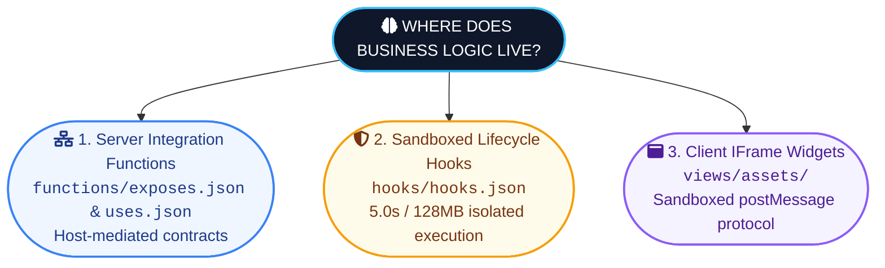

# 1. Executive Overview & Architectural Core Principles

## 1.1 The 100% Declarative Engine Vision

The UNIVA Module System solves the classic enterprise extension dilemma: how to allow third-party developers, custom domain builders, or tenant organizations to extend software capabilities **without introducing arbitrary code execution vulnerabilities, platform instability, or complex deployment rebuild cycles**.

In traditional monolithic extensions (such as unvetted Python plugins), plugins execute arbitrary server code in the host process. If a plugin crashes, memory leaks, or contains security exploits, the entire host application suffers.

UNIVA replaces arbitrary plugin code with a **100% Declarative Engine Architecture**. Modules do not supply executable backend code; instead, they supply structured JSON manifests, database field specifications, security matrices, UI view definitions, and contract declarations. The **UNIVA Installer Engine** reads, validates, and materializes these declarations using standardized system primitives built directly into the host platform.

---

## 1.2 The "No Arbitrary Executable Code in Modules" Guarantee

Under UNIVA rules, **modules never ship unvetted executable logic in the backend process**.

- **Database Schema**: Created via fixed DDL generators driven by `models/*.json`.
- **Security Policies**: Seeded into system RBAC/ABAC tables driven by `security/access.json`.
- **Cross-Module Behavior**: Executed via named, versioned integration function contracts (`integrations/uses.json` and `functions/exposes.json`) dispatched through the host's controlled `FunctionRegistry`.
- **UI Customization**: Rendered dynamically via standard layout renderers, or loaded as static CSS/JS bundles inside sandboxed `<iframe sandbox="allow-scripts">` containers using the browser `postMessage` protocol.

!!! note "Security Policies & Role Ownership Boundary"
    A module's `security/access.json` should only ever seed access rules that reference existing permission points — which models, fields, and features a role may touch. Roles themselves — their creation, and which real user account holds which role — are owned entirely by the platform's user-management system (`app_user`, `role`, `user_role`). A module declares *what can be granted*; only the platform decides *who it's granted to*.

---

## 1.3 Zero-Preinstalled-Tables Engine Architecture

The host application starts up with **0 pre-installed domain tables**. System tables (`account`, `app_user`, `module_catalog`, `account_module_install`, `sys_model`, `sys_field`, `role`, `user_role`, `role_model_access`) form the core infrastructure platform.

When a tenant admin clicks "Install" on a module (e.g. `farms` or `invoicing`):

1. The engine reads the declarative definitions from the module folder.
2. The Database Engine creates physical SQL tables (`mod_farms_farm`, `mod_invoicing_invoice`).
3. The Security Engine seeds tenant roles and access control rules.
4. The UI Engine registers view schemas into `sys_view`.
5. The sidebar menu updates dynamically without restarting the server or refreshing the frontend bundle.

---

## 1.4 Frontend Live-Rendering ("No Swap / No Rebuild") Paradigm

Installing or upgrading a module requires **zero frontend rebuilds or Webpack/Vite compiles**.

The frontend application contains a generic, dynamic rendering engine (`DynamicModulePage.jsx`). When a user accesses a module route, the frontend fetches view specifications from the installer service (`/api/modules/:module_name/views`). The renderer dynamically generates tables, action buttons, progress bars, status badges, and modal forms directly from metadata.

If a module includes custom UI components (`views/assets/widget.js`), the frontend loads those assets inside an isolated `<iframe>` element. The iframe communicates with the parent app strictly via structured JSON messages (`postMessage`), ensuring custom UI widgets cannot directly access local storage, authentication tokens, or global window variables.

---

## 1.5 System Component Blueprint

The system architecture is decoupled into distinct component layers:

| Component Layer | Responsibility |
|---|---|
| **UNIVA Installer Engine** | 5-Engine Installer, Data REST APIs, Function Registry, System Tables (`sys_model`/`sys_field`). |
| **Dynamic UI Renderer** | Dynamic Module Views (`DynamicModulePage.jsx`), Sandboxed IFrame Host (`postMessage` protocol). |

---

## 1.6 Engine Implementation Maturity Matrix

To maintain transparency as the platform evolves, the following matrix tracks the implementation status of each engine:

| Engine Component | Implementation Status | Current Capabilities |
|---|---|---|
| **Engine 1 — Manifest Engine** | **Implemented** | Manifest parsing, SemVer checks, prerequisite verification, `requires_integration` checks. |
| **Engine 2 — Database Engine** | **Implemented** | Safe DDL generation, `sys_model`/`sys_field` registration, partial unique indexes (`WHERE deleted_at IS NULL`). |
| **Engine 3 — Integration Engine** | **Implemented** | Phase 2 Foreign Keys (`sys_field_relation`), namespaced target resolution (`module.model`), `FunctionRegistry` dispatcher. |
| **Engine 4 — Security Engine** | **Implemented** | Role seeding, `role_model_access` CRUD matrices, `role_field_access` rules, ABAC row-level filters (`role_record_rule`). |
| **Engine 5 — UI Engine** | **Implemented** | `views/*.json` registration, fallback auto-generator, static asset manifest, sandboxed IFrame `postMessage` protocol. |

---

## 1.7 SQL Identifier Validation & Injection Defense

To prevent SQL injection vulnerabilities when building DDL dynamically (`ALTER TABLE`, `ADD CONSTRAINT`, `CREATE INDEX`), the engine enforces strict regex validation on all SQL identifiers prior to DDL string interpolation.

```python
import re

IDENTIFIER_RE = re.compile(r"^[a-z0-9_]{1,63}$")

class InvalidIdentifierError(Exception):
    pass

def assert_safe_identifier(value: str, kind: str = "identifier") -> str:
    """Raise InvalidIdentifierError if value is not a safe SQL identifier. Returns value unchanged if safe."""
    if not isinstance(value, str) or not IDENTIFIER_RE.match(value):
        raise InvalidIdentifierError(
            f"Invalid {kind} '{value}': must match regex ^[a-z0-9_]{{1,63}}$"
        )
    return value
```

Every database operation splices identifiers ONLY after passing through `assert_safe_identifier()`.

---

## 1.8 Where Does Business Logic Live in UNIVA Modules?

Because UNIVA modules **never ship arbitrary executable server code directly inside the module package**, business logic is split cleanly across **3 controlled channels**:



1. **Host Integration Functions (`functions/exposes.json` & `integrations/uses.json`)**:
   - For host-mediated calculations, data transformations, or cross-module logic (e.g. `invoicing.get_invoice_total`).
   - Defined as schema-validated JSON contracts in `exposes.json`.
   - Implementation handlers are registered in the host platform's `FunctionRegistry` and called safely with schema validation.
2. **Event Lifecycle Hooks (`hooks/hooks.json`)**:
   - For installation, upgrade, or uninstallation events (e.g. seeding default data).
   - Executed inside isolated process sandboxes with resource limits (5.0s timeout, 128MB memory limit).
3. **Interactive Client View Logic (`views/assets/widget.js`)**:
   - For complex UI interactions, custom charts, or multi-step form wizards.
   - Executed inside sandboxed `<iframe sandbox="allow-scripts">` containers communicating via `postMessage`.

---

## Command Line Code Reference

```powershell
# Command line to run tests verifying identifier validation regex
python -c "from assert_safe import assert_safe_identifier; print(assert_safe_identifier('valid_name_123'))"
```
