# 2. The Two Fundamental Module Types

In the UNIVA Module System, every module is strictly classified as either a **Main Module** or an **Extension Module**.

```mermaid
flowchart TD
    Root(["<i class='fa-solid fa-cubes'></i> UNIVA MODULE CLASSIFICATION"])
    
    Root --> Main(["<i class='fa-solid fa-building-columns'></i> Main Module<br/><code>module_type: 'main'</code>"])
    Root --> Ext(["<i class='fa-solid fa-puzzle-piece'></i> Extension Module<br/><code>module_type: 'extension'</code>"])
    
    Main --> M1(["<i class='fa-solid fa-database'></i> Owns models & SQL tables"])
    Main --> M2(["<i class='fa-solid fa-table-cells'></i> Owns UI list/form views"])
    Main --> M3(["<i class='fa-solid fa-user-shield'></i> Owns security RBAC/ABAC"])
    Main --> M4(["<i class='fa-solid fa-bolt'></i> Hosts wizards & hooks"])
    
    Ext --> E1(["<i class='fa-solid fa-ban'></i> Zero physical database tables"])
    Ext --> E2(["<i class='fa-solid fa-desktop'></i> No standalone sidebar links"])
    Ext --> E3(["<i class='fa-solid fa-square-plus'></i> Injects buttons & export tabs"])
    Ext --> E4(["<i class='fa-solid fa-sliders'></i> Live metadata-driven extenders"])
    
    style Root fill:#0f172a,stroke:#38bdf8,stroke-width:2px,color:#ffffff
    style Main fill:#1e3a8a,stroke:#3b82f6,stroke-width:2px,color:#ffffff
    style Ext fill:#065f46,stroke:#10b981,stroke-width:2px,color:#ffffff
    style M1 fill:#eff6ff,stroke:#60a5fa,color:#1e3a8a
    style M2 fill:#eff6ff,stroke:#60a5fa,color:#1e3a8a
    style M3 fill:#eff6ff,stroke:#60a5fa,color:#1e3a8a
    style M4 fill:#eff6ff,stroke:#60a5fa,color:#1e3a8a
    style E1 fill:#ecfdf5,stroke:#34d399,color:#065f46
    style E2 fill:#ecfdf5,stroke:#34d399,color:#065f46
    style E3 fill:#ecfdf5,stroke:#34d399,color:#065f46
    style E4 fill:#ecfdf5,stroke:#34d399,color:#065f46
```



---

## 2.1 Main Modules (`module_type: "main"`)

A **Main Module** represents a complete, self-contained business domain.

- **Data Layer**: Defines physical database tables in `models/*.json` (e.g. `mod_farms_farm`, `mod_farms_sensor`).
- **UI Layer**: Defines primary list and form views in `views/*.json` (e.g. `farm_list.json`, `farm_form.json`).
- **Security Layer**: Defines default roles and access policies in `security/access.json`.
- **Navigation**: Appears as a top-level sidebar navigation item.
- **Examples**: `farms`, `invoicing`, `inventory`, `schedule`, `support`, `alerts`, `reports`, `users`.

**Main Module Folder Structure**:
```
modules/<main_module_name>/
├── manifest.json              ← REQUIRED: Manifest metadata (module_type: "main")
├── models/                    ← REQUIRED: Physical database table specifications
│   ├── <model_1>.json
│   └── <model_2>.json
├── security/                  ← REQUIRED: RBAC & ABAC security rules
│   └── access.json
├── secrets/                   ← OPTIONAL: Secret key declarations
│   └── schema.json
├── views/                     ← REQUIRED: UI view specifications
│   ├── <model_1>_list.json
│   ├── <model_1>_form.json
│   └── assets/                ← OPTIONAL: Custom iframe widget assets
├── integrations/              ← OPTIONAL: Cross-module dependencies (uses.json)
├── functions/                 ← OPTIONAL: Exposed cross-module functions (exposes.json)
├── default_data/              ← OPTIONAL: Role & field rule seeding
├── migrations/                ← OPTIONAL: Incremental schema migration files
└── hooks/                     ← OPTIONAL: Lifecycle hooks (hooks.json)
```

---

## 2.2 Extension Modules (`module_type: "extension"`)

An **Extension Module** enhances or augments existing Main Modules without owning standalone database tables.

- **Data Layer**: Does NOT create database tables (`models: []`).
- **UI Layer**: Injects buttons, actions, tab panels, or export tools into existing Main Module views via `ui_extensions[]`.
- **Functionality**: Reuses existing APIs or provides specialized client-side transformations (e.g. PDF generation, CSV exports, specialized calculations).
- **Navigation**: Does NOT create separate sidebar navigation items; instead, injects actions into host views.
- **Examples**: `pdf_exporter`.

**Extension Module Folder Structure**:
```
modules/<extension_module_name>/
├── manifest.json              ← REQUIRED: Manifest metadata (module_type: "extension")
├── security/                  ← REQUIRED: Role permissions extension
│   └── access.json
├── views/                     ← OPTIONAL: Asset-only / injected UI widgets
│   └── assets/
│       ├── style.css
│       └── widget.js          ← Sandboxed JavaScript (postMessage protocol)
├── default_data/              ← OPTIONAL: Seed data or configuration extensions
├── functions/                 ← OPTIONAL: Exposed helper integration functions
├── integrations/              ← OPTIONAL: Required integration function specs
└── hooks/                     ← OPTIONAL: Lifecycle event callbacks
```
> **Note**: Extension modules **MUST NOT** include a `models/` directory or declare items in the `models[]` manifest array.

---

## 2.3 Feature Matrix & Feature Comparison

| Feature Capability | Main Module (`"main"`) | Extension Module (`"extension"`) |
|---|---|---|
| **Manifest `module_type`** | `"main"` | `"extension"` |
| **Database Models (`models/`)** | Allowed (`models: ["invoice", ...]`) | Prohibited (`models: []`) |
| **Physical Tables Created** | Creates `mod_<module>_<model>` | Zero physical SQL tables created |
| **Sidebar Navigation** | Renders primary sidebar link | No sidebar link created |
| **UI View Definitions (`views/`)** | Declares full list & form views | Injects UI extension widgets |
| **Custom Widget Assets** | Supported in `views/assets/` | Supported in `views/assets/` |
| **Integration Function Exposing** | Supported (`functions/exposes.json`) | Supported (`functions/exposes.json`) |
| **Integration Function Calling** | Supported (`integrations/uses.json`) | Supported (`integrations/uses.json`) |
| **RBAC Role Seeding** | Seeds default domain roles | Extends existing role permissions |

---

## Command Line Validation Code

```powershell
# Command line to check module types across manifests using PowerShell
Get-ChildItem -Path "modules" -Filter "manifest.json" -Recurse | ForEach-Object {
    $m = Get-Content $_.FullName | ConvertFrom-Json
    [PSCustomObject]@{ Module = $m.name; Type = $m.module_type; Version = $m.version }
}
```
