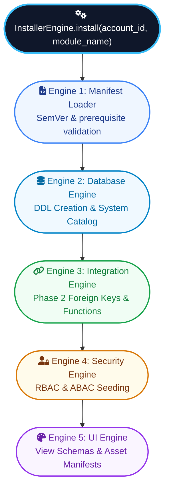

# 4. The Five-Engine Installer Orchestration Architecture

## 4.1 Overview of the 5-Engine Pipeline

When `install_module(account_id, module_name, user_id)` is invoked, the installer coordinates five specialized sub-engines in strict order:



1. **Engine 1 — Manifest Engine**: Loads `manifest.json`, validates identifiers using `assert_safe_identifier()`, verifies module provenance & package signature (`provenance`), checks platform version compatibility (`requires_platform_version`), checks module prerequisites (`depends`), and confirms integration function availability (`requires_integration`).
2. **Engine 2 — Database Engine**: Parses `models/*.json`, diffs specs against system catalog (`sys_model`/`sys_field`), constructs safe DDL statements, creates physical SQL tables with system columns (`id`, `account_id`, `created_at`, `updated_at`, `deleted_at`), creates partial unique indexes (`WHERE deleted_at IS NULL`), and creates relation fields as plain UUID columns first.
3. **Engine 3 — Integration Engine**: Phase 2 link resolution — verifies target models exist using namespaced target resolution (`"module_name.model_name"`) and applies Foreign Key constraints (`sys_field_relation`). Validates and registers exposed function contracts (`functions/exposes.json`).
4. **Engine 4 — Security Engine**: Reads `security/access.json` and `default_data/roles.json`, creates tenant roles (`role`), seeds model access permissions (`role_model_access`), field access rules (`role_field_access`), and ABAC domain filters (`role_record_rule`) with strict operator whitelisting. Manages `sys_secret` encrypted vault declarations.
5. **Engine 5 — UI Engine**: Reads `views/*.json` schemas, generates fallback list/form views for unconfigured models, registers views into `sys_view`, registers static custom widget bundles (`views/assets/`) into `sys_module_assets`, and invalidates UI caches.

---

## 4.2 Stage-by-Stage Execution Sequence (`InstallerEngine.install`)

The installer executes the following sequence for a single `install(account_id, module_name, installed_by_user_id)` call:

- **Stage -2 — Provenance & Signature Verification (`ProvenanceEngine.verify`)**: SHA-256 hash verified against `provenance.package_sha256`; Ed25519 signature verified against trusted-publisher keyring (`signing_key_id`). Unsigned modules require explicit org-level admin consent toggle.
- **Stage -1 — Platform Version Compatibility Gate**: `requires_platform_version` checked against running `PLATFORM_VERSION` using `semver_satisfies()`. Aborts before DDL or filesystem changes if incompatible.
- **Pre-Install Admin Permission & Consent Surface**: Mechanically derives scope list from manifest data (`models`, `requires_integration`, `default_roles`/`features`, hooks, publisher provenance, secrets) and renders admin confirmation screen before installation proceeds.
- **Stage 0 — Guard, Lock & Tenant Quotas**: Account ID and module name validated. `QuotaEngine.check(account_id, module)` verifies tenant limits (`max_tables_per_module`, `max_fields_per_model`, `max_storage_mb`, `max_hook_executions_per_minute`, `max_installed_modules`). Atomic lock acquired: `install:{account_id}:{module_name}`. Emitter records `emit_audit_log("install.started")`.
- **Stage 1 — Manifest Validation (Engine 1)**: `manifest.json` loaded and validated against JSON schema. Dependencies in `depends` and `requires_integration` checked. Emitter records stage completion.
- **Stage 2 — Schema Materialization (Engine 2)**: Models diffed against `sys_model`/`sys_field`. Physical SQL tables created with system columns. Relation fields created as UUID columns. Partial unique indexes created. Emitter records stage completion.
- **Stage 3 — Link & Function Resolution (Engine 3)**: Relation fields resolved to target models (`"module.model"`). Foreign keys attached via `ALTER TABLE`. Exposed function contracts registered. Emitter records stage completion.
- **Stage 4 — Security Seeding (Engine 4)**: Roles and permission rules seeded with operator whitelisting into `role_model_access`, `role_field_access`, `role_record_rule`. Secret key placeholders registered in `sys_secret`. Emitter records stage completion.
- **Stage 5 — UI Registration (Engine 5)**: View specs registered into `sys_view`; widget bundles registered into `sys_module_assets`. Emitter records stage completion.
- **Stage 6 — Record Install State**: Entry written to `sys_installed_module`.
- **Stage 7 — Commit**: Database transaction commits atomically.
- **Stage 8 — Lifecycle Hook (`on_install`)**: Module installation hook runs post-commit in gVisor (`runsc`) isolated sandbox process.
- **Stage 9 — Cache Invalidation & Audit Completion**: Account permission and view caches cleared. Emitter records `emit_audit_log("install.completed")`. Lock released.

---

## 4.3 Transaction Management, Rollbacks, and Concurrency Locking

To prevent partial installations, corrupted schemas, or race conditions during simultaneous module installations across multi-tenant accounts:

- **Concurrency Locking**: An atomic lock (`install:{account_id}:{module_name}`) is acquired before installation begins.
- **Database Transaction Scope**: All DDL executions, `sys_model`/`sys_field` registrations, role seedings, and view registrations execute inside a single transactional block.
- **Automated Rollback**: Any failure during schema creation, dependency checking, FK constraint addition, or hook execution triggers an immediate database transaction rollback (`ROLLBACK`).
- **Cache Invalidation**: Permission caches and model registries for the target account are invalidated ONLY after a successful transaction commit.

---

## Command Line Execution Code

```powershell
# Command line to trigger module install via API using PowerShell
$body = @{ account_id = "acc_1001"; module_name = "farms" } | ConvertTo-Json
Invoke-RestMethod -Uri "http://localhost:8001/api/modules/farms/install" -Method Post -Body $body -ContentType "application/json"
```
