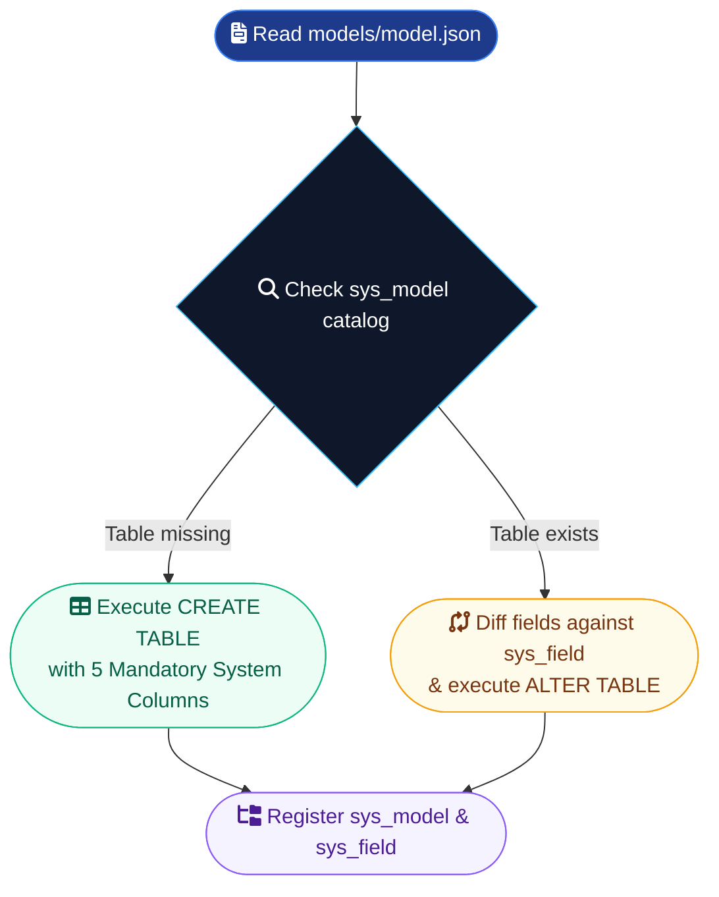

# 6. Engine 2 — Database Engine & Declarative Schemas (`models/*.json`)

## 6.1 Database Engine Responsibilities & Materialization Workflow

The **Database Engine** is the sole authority responsible for physical SQL DDL execution. It transforms declarative JSON model specifications (`models/*.json`) into physical database tables.



---

## 6.2 Supported Data Types & SQL Type Mapping Table

Engine 2 translates high-level model types into standard SQL column types:

| Declarative `type` | PostgreSQL DDL Type | SQLite DDL Type | TypeScript UI Type | Default Column Constraint |
|---|---|---|---|---|
| `"string"` | `TEXT` | `TEXT` | `string` | `NULL` |
| `"numeric"` | `NUMERIC(15,2)` | `REAL` | `number` | `NULL` |
| `"integer"` | `INTEGER` | `INTEGER` | `number` | `NULL` |
| `"float"` | `DOUBLE PRECISION` | `REAL` | `number` | `NULL` |
| `"boolean"` | `BOOLEAN` | `INTEGER` | `boolean` | `DEFAULT FALSE` |
| `"date"` | `DATE` | `TEXT` | `string` (YYYY-MM-DD) | `NULL` |
| `"datetime"` | `TIMESTAMP` | `TEXT` | `string` (ISO-8601) | `NULL` |
| `"uuid"` | `UUID` | `TEXT` | `string` (UUIDv4) | `NULL` |
| `"json"` | `JSONB` | `TEXT` | `object` / `array` | `NULL` |
| `"relation"` | `UUID` | `TEXT` | `string` (UUIDv4) | Plain UUID first (Phase 2 FK) |

---

## 6.3 Mandatory System Columns (`id`, `account_id`, `created_at`, `updated_at`, `deleted_at`)

Every physical SQL table created by Engine 2 MUST contain the following 5 system columns:

```sql
CREATE TABLE mod_invoicing_invoice (
    id VARCHAR(36) PRIMARY KEY,
    account_id VARCHAR(36) NOT NULL,
    created_at TIMESTAMP DEFAULT CURRENT_TIMESTAMP,
    updated_at TIMESTAMP DEFAULT CURRENT_TIMESTAMP,
    deleted_at TIMESTAMP NULL,
    
    -- Declarative Model Fields
    number TEXT NOT NULL,
    customer_id VARCHAR(36) NULL,
    total_amount NUMERIC(15,2) NULL,
    status TEXT DEFAULT 'draft'
);
```

- **`id`**: Unique primary key UUID (UUIDv4 string).
- **`account_id`**: Multi-tenant account isolation key. Every query executed via `chokepoint.py` automatically filters by `account_id`.
- **`created_at`**: Timestamp when record was created.
- **`updated_at`**: Timestamp when record was last updated.
- **`deleted_at`**: Soft-delete timestamp (`NULL` indicates active record). Physical `DELETE` SQL queries are strictly prohibited; records are soft-deleted by setting `deleted_at = NOW()`.

---

## 6.4 Soft Delete vs Unique Constraints (Partial Unique Indexes)

**Problem Solved**: Records are soft-deleted (`deleted_at = NOW()`). Standard unique constraints (`UNIQUE(number)`) would prevent reusing a natural key (e.g. `invoice.number = "INV-1001"`) if an older deleted row exists.

**Solution**: Whenever a field spec declares `"unique": true`, Engine 2 constructs a **Partial Unique Index** scoped strictly to active rows (`WHERE deleted_at IS NULL`).

**PostgreSQL & SQLite 3.8+ DDL**:
```sql
CREATE UNIQUE INDEX ux_mod_invoicing_invoice_number
ON mod_invoicing_invoice (account_id, number)
WHERE deleted_at IS NULL;
```

This guarantees uniqueness across active records while allowing natural key reuse after soft deletion.

---

## 6.5 Model JSON Schema Specifications & Field Attributes

**Example: `modules/invoicing/models/invoice.json`**:

```json
{
  "name": "invoice",
  "table_name": "mod_invoicing_invoice",
  "label": "Customer Invoice",
  "description": "Customer billing invoice header record",
  "fields": [
    {
      "name": "number",
      "type": "string",
      "required": true,
      "unique": true,
      "label": "Invoice Number",
      "description": "Unique billing invoice reference number",
      "searchable": true
    },
    {
      "name": "customer_id",
      "type": "relation",
      "relation_target": "contacts_base.contact",
      "required": true,
      "label": "Customer Contact",
      "description": "Foreign key reference to contacts_base contact model"
    },
    {
      "name": "total_amount",
      "type": "numeric",
      "required": true,
      "default": 0.00,
      "label": "Total Invoice Amount"
    },
    {
      "name": "status",
      "type": "string",
      "required": true,
      "default": "draft",
      "options": ["draft", "sent", "paid", "cancelled"],
      "label": "Invoice Status"
    }
  ]
}
```

---

## 6.6 System Tables (`sys_model`, `sys_field`) Schema

Engine 2 maintains the system catalog in `sys_model` and `sys_field`:

```sql
CREATE TABLE sys_model (
    id VARCHAR(36) PRIMARY KEY,
    account_id VARCHAR(36) NOT NULL,
    module_name VARCHAR(100) NOT NULL,
    name VARCHAR(100) NOT NULL,
    table_name VARCHAR(120) NOT NULL,
    label VARCHAR(150),
    description VARCHAR(255),
    created_at TIMESTAMP DEFAULT CURRENT_TIMESTAMP,
    UNIQUE(account_id, module_name, name)
);

CREATE TABLE sys_field (
    id VARCHAR(36) PRIMARY KEY,
    model_id VARCHAR(36) REFERENCES sys_model(id) ON DELETE CASCADE,
    name VARCHAR(100) NOT NULL,
    field_type VARCHAR(50) NOT NULL,
    required BOOLEAN DEFAULT FALSE,
    default_value VARCHAR(255),
    options JSONB,
    is_searchable BOOLEAN DEFAULT TRUE,
    relation_target VARCHAR(100),
    created_at TIMESTAMP DEFAULT CURRENT_TIMESTAMP,
    UNIQUE(model_id, name)
);
```

---

## 6.7 Database Engine Materialization Logic

```python
import os
import json
import uuid
from typing import List, Any
from sqlalchemy import Column, String, Integer, Float, Boolean, DateTime, Table, MetaData, inspect, text

class DatabaseEngine:
    TYPE_MAP = {
        "string": String(500),
        "numeric": Float,
        "integer": Integer,
        "float": Float,
        "boolean": Boolean,
        "date": DateTime,
        "datetime": DateTime,
        "uuid": String(36),
        "json": String(2000),
        "relation": String(36)  # Relation columns created as String(36) UUID first
    }

    def __init__(self, engine, db_session):
        self.engine = engine
        self.db = db_session

    def materialize_schema(self, module, account_id: str) -> List[Any]:
        safe_account_id = assert_safe_identifier(account_id, "account ID")
        created_sys_models = []
        inspector = inspect(self.engine)
        existing_tables = inspector.get_table_names()

        for model_name in module.models:
            safe_model_name = assert_safe_identifier(model_name, "model name")
            model_file = os.path.join(module.directory, "models", f"{safe_model_name}.json")
            if not os.path.exists(model_file):
                continue

            with open(model_file, "r", encoding="utf-8") as f:
                model_spec = json.load(f)

            table_name = assert_safe_identifier(
                model_spec.get("table_name", f"mod_{module.name}_{safe_model_name}"), "table name"
            )
            fields = model_spec.get("fields", [])

            # Phase 1: Physical SQL Table Creation
            if table_name not in existing_tables:
                metadata = MetaData()
                columns = [
                    Column("id", String(36), primary_key=True, default=lambda: str(uuid.uuid4())),
                    Column("account_id", String(36), nullable=False),
                    Column("created_at", DateTime),
                    Column("updated_at", DateTime),
                    Column("deleted_at", DateTime, nullable=True)
                ]

                for field in fields:
                    fname = assert_safe_identifier(field["name"], "field name")
                    ftype = field.get("type", "string")
                    sa_type = self.TYPE_MAP.get(ftype, String(500))
                    nullable = not field.get("required", False)
                    columns.append(Column(fname, sa_type, nullable=nullable))

                Table(table_name, metadata, *columns, extend_existing=True)
                metadata.create_all(bind=self.engine)
                metadata.clear()

                # Phase 1b: Partial Unique Indexes for unique fields
                for field in fields:
                    if field.get("unique", False):
                        fname = assert_safe_identifier(field["name"], "field name")
                        idx_name = assert_safe_identifier(f"ux_{table_name}_{fname}", "index name")
                        idx_sql = f"""
                            CREATE UNIQUE INDEX {idx_name}
                            ON {table_name} (account_id, {fname})
                            WHERE deleted_at IS NULL;
                        """
                        try:
                            self.db.execute(text(idx_sql))
                        except Exception as e:
                            logger.warning(f"Index creation notice on {idx_name}: {e}")

            # Phase 2: System Catalog Registration (sys_model & sys_field)
            sys_model = self._upsert_sys_model(safe_account_id, module.name, safe_model_name, table_name, model_spec)
            self._upsert_sys_fields(sys_model.id, fields)
            created_sys_models.append(sys_model)

        return created_sys_models
```

---

## Command Line Schema Test Code

```powershell
# Command line to inspect created table structures in SQLite
sqlite3 sis.db ".schema mod_invoicing_invoice"
```
