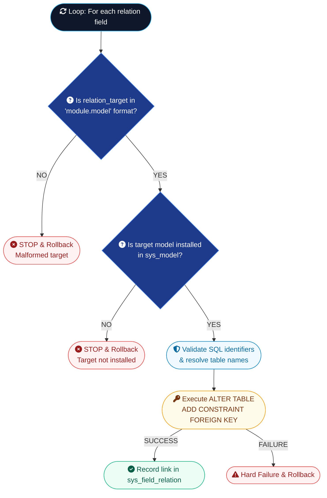

# 7. Engine 3 — Integration Engine (Data Linking & Function Contracts)

## 7.1 Cross-Module Communication Design Principles

In multi-tenant architecture, modules MUST be decoupled. Module A (`invoicing`) cannot directly import Python modules or issue raw cross-table SQL joins against Module B (`contacts_base`).

The **Integration Engine** provides two disciplined communication channels:

1. **Namespaced Data Linking**: Declarative relation fields using `"module_name.model_name"` format that resolve into physical Foreign Key constraints once target models exist.
2. **Function Calling**: Contract-based, schema-validated behavior invocation dispatched via `FunctionRegistry`.

---

## 7.2 Mechanism A — Namespaced Data Linking (`"module.model"`) & Two-Phase FK Constraints

To prevent model name collisions across modules, `relation_target` MUST be fully qualified as `"target_module_name.target_model_name"` (e.g. `"contacts_base.contact"`).

- **Phase 1 (Engine 2)**: `customer_id` is created as a plain `VARCHAR(36)` UUID column during initial DDL materialization.
- **Phase 2 (Engine 3)**: Engine 3 parses `relation_target`, validates target module and model, verifies target table in `sys_model`, attaches Foreign Key constraint, and records dependency in `sys_field_relation`.

**The resolution flow, step by step, for every relation field belonging to the module being installed:**



!!! warning "FK Resolution Error Enforcement"
    If the `ALTER TABLE ... ADD CONSTRAINT` statement fails, Engine 3 MUST treat it as a hard failure and trigger a transaction rollback (`ROLLBACK`), preventing orphan relation columns.

---

## 7.3 Foreign Key Tracking Table (`sys_field_relation`) & Safe Uninstall Checks

```sql
CREATE TABLE sys_field_relation (
    id VARCHAR(36) PRIMARY KEY,
    source_field_id VARCHAR(36) REFERENCES sys_field(id) ON DELETE CASCADE,
    target_model_id VARCHAR(36) REFERENCES sys_model(id) ON DELETE CASCADE,
    created_at TIMESTAMP DEFAULT CURRENT_TIMESTAMP
);
```

When a user attempts to uninstall a module (e.g. `contacts_base`):

1. Engine 3 queries `sys_field_relation` for any active relations pointing to `contacts_base` models.
2. If `invoicing` has active relations pointing to `contacts_base`, the uninstallation is blocked with a clear warning:
   `"Cannot uninstall contacts_base: module 'invoicing' depends on field relation invoice.customer_id."`

---

## 7.4 Mechanism B — Function Calling (`integrations/uses.json` & `functions/exposes.json`)

When Module B needs to call logic owned by Module A:

**`contacts_base/functions/exposes.json`**:
```json
{
  "functions": [
    {
      "name": "get_contact",
      "description": "Fetches formatted contact record by ID",
      "input_schema": {
        "contact_id": "string"
      },
      "output_schema": {
        "id": "string",
        "display_name": "string",
        "email": "string",
        "phone": "string"
      },
      "implementation": "contacts_base.services.get_contact"
    }
  ]
}
```

**`invoicing/integrations/uses.json`**:
```json
{
  "requires": [
    {
      "module": "contacts_base",
      "function": "get_contact"
    }
  ]
}
```

---

## 7.5 Function Registry Runtime Dispatcher & Schema Validation Implementation

```python
from typing import Dict, Any

class SchemaValidationError(Exception):
    pass

class FunctionRegistry:
    def __init__(self, db_session):
        self.db = db_session
        self.function_table = {}

    def register_implementation(self, function_key: str, handler_callable):
        self.function_table[function_key] = handler_callable

    def call(self, caller_module: str, target_module: str, function_name: str, args: Dict[str, Any], account_id: str) -> Dict[str, Any]:
        # 1. Verify caller declared dependency
        if not self._verify_declared_use(caller_module, target_module, function_name):
            raise PermissionError(f"Module '{caller_module}' did not declare dependency on '{target_module}.{function_name}' in integrations/uses.json")

        # 2. Verify target module is installed for account
        if not self._is_module_installed(account_id, target_module):
            raise ModuleInstallError(f"Target module '{target_module}' is not installed for account '{account_id}'")

        # 3. Fetch function schema definition
        func_spec = self._get_function_spec(target_module, function_name)
        self._validate_schema(args, func_spec["input_schema"])

        # 4. Dispatch invocation
        handler = self.function_table.get(func_spec["implementation"])
        if not handler:
            raise NotImplementedError(f"Implementation '{func_spec['implementation']}' is not registered.")

        result = handler(args, account_id)
        self._validate_schema(result, func_spec["output_schema"])
        return result

    def _validate_schema(self, data: Dict[str, Any], schema: Dict[str, str]):
        for key, expected_type in schema.items():
            if key not in data:
                raise SchemaValidationError(f"Missing required payload key: '{key}'")
```

---

## Command Line Verification Code

```powershell
# Command line to inspect active field relation links in database
sqlite3 sis.db "SELECT * FROM sys_field_relation;"
```
