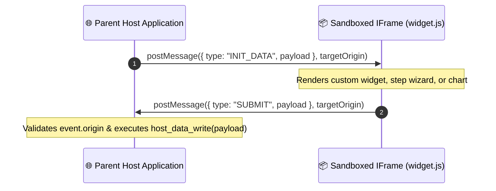

# 9. Engine 5 — UI Engine & Live View Registration (`views/`)

## 9.1 View Spec Registration (`sys_view`) & Automatic Fallback Generator

The **UI Engine** registers view specifications into system tables (`sys_view`, `sys_module_assets`). If a module does not supply custom JSON view files, Engine 5 automatically inspects `sys_field` and auto-generates standard view specs.

```python
import os
from typing import List, Any

class UIEngine:
    def __init__(self, db_session):
        self.db = db_session

    def register_views_and_assets(self, module, account_id: str, sys_models: List[Any]):
        for sys_m in sys_models:
            list_view_file = os.path.join(module.directory, "views", f"{sys_m.name}_list.json")
            form_view_file = os.path.join(module.directory, "views", f"{sys_m.name}_form.json")

            list_spec = self._read_or_generate_list(list_view_file, sys_m)
            form_spec = self._read_or_generate_form(form_view_file, sys_m)

            self._upsert_sys_view(account_id, sys_m.id, "list", list_spec)
            self._upsert_sys_view(account_id, sys_m.id, "form", form_spec)

        self._register_assets(module, account_id)

    def _generate_fallback_list(self, sys_m):
        fields = self.db.query(SysField).filter(SysField.model_id == sys_m.id).all()
        return {
            "view_id": f"view_{sys_m.name}_list",
            "model": sys_m.name,
            "type": "list",
            "title": f"{sys_m.label} Overview",
            "columns": [{"field": f.name, "label": f.name.replace("_", " ").title()} for f in fields],
            "actions": ["create", "edit", "delete"]
        }
```

---

## 9.2 List View Schema (`<model>_list.json`) & Column Widgets

**`modules/invoicing/views/invoice_list.json`**:

```json
{
  "view_id": "view_invoice_list",
  "model": "invoice",
  "type": "list",
  "title": "Invoices Overview",
  "columns": [
    { "field": "number", "label": "Invoice #", "sortable": true, "filterable": true },
    { "field": "customer_id", "label": "Customer", "widget": "relation", "relation_label_field": "display_name" },
    { "field": "total_amount", "label": "Total Amount", "widget": "currency", "currency_code": "USD" },
    { "field": "status", "label": "Status", "widget": "badge", "badge_colors": { "draft": "yellow", "paid": "green", "cancelled": "red" } }
  ],
  "actions": ["create", "edit", "delete"]
}
```

---

## 9.3 Form View Schema (`<model>_form.json`) & Section Layouts

**`modules/invoicing/views/invoice_form.json`**:

```json
{
  "view_id": "view_invoice_form",
  "model": "invoice",
  "type": "form",
  "title": "Customer Invoice Form",
  "layout": {
    "sections": [
      {
        "title": "Header Information",
        "columns": 2,
        "fields": [
          { "name": "number", "widget": "input_text", "label": "Invoice Number", "required": true },
          { "name": "customer_id", "widget": "dropdown_select", "label": "Customer Contact", "required": true }
        ]
      },
      {
        "title": "Billing Summary",
        "columns": 2,
        "fields": [
          { "name": "total_amount", "widget": "input_currency", "label": "Total Amount" },
          { "name": "status", "widget": "select_dropdown", "label": "Status", "options": ["draft", "sent", "paid", "cancelled"] }
        ]
      }
    ]
  }
}
```

---

## 9.4 Asset Bundles (`views/assets/`) & Static Asset Manifests

If a module requires a custom widget, static files live in `views/assets/`:

- `views/assets/style.css`
- `views/assets/widget.js`

Engine 5 registers these assets in `sys_module_assets`:

```json
{
  "module": "invoicing",
  "version": "1.0.0",
  "assets": {
    "css": ["/module-assets/invoicing/1.0.0/style.css"],
    "js": ["/module-assets/invoicing/1.0.0/widget.js"]
  }
}
```

---

## 9.5 Sandboxed IFrame Architecture & `postMessage` Protocol Contract

Custom UI widgets are ONLY loaded inside a sandboxed `<iframe>` element. The iframe NEVER receives authentication tokens or direct database API access.



**`views/assets/widget.js` (Sandboxed Widget Side)**:

```javascript
// Running strictly inside sandboxed iframe
window.addEventListener("message", (event) => {
  if (event.data && event.data.type === "INIT_DATA") {
    const record = event.data.payload;
    document.getElementById("title").innerText = record.number;
  }
});

function submitChanges(updatedPayload) {
  window.parent.postMessage(
    { type: "SUBMIT", payload: updatedPayload },
    window.HOST_ORIGIN // Injected at iframe load time, NEVER "*"
  );
}
```

**Parent Host Application (Host Listener Side)**:

```javascript
// Parent host — must validate origin AND source before trusting message
window.addEventListener("message", (event) => {
  if (event.origin !== expectedOriginForThisModule || event.source !== iframeRef.contentWindow) {
    return; // Reject silently, no processing
  }
  if (!isValidMessageShape(event.data)) return;
  host_data_write(event.data.payload);
});
```

`expectedOriginForThisModule` is configured as the specific origin serving the module's static assets (e.g. a per-module sandboxed subdomain), enforcing tenant and module isolation.

---

## Command Line UI View Spec Audit Code

```powershell
# Command line to inspect registered views via REST endpoint
Invoke-RestMethod -Uri "http://localhost:8001/api/modules/invoicing/views" -Method Get
```
