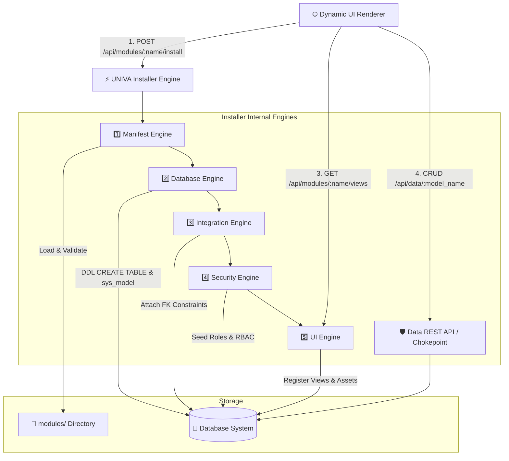
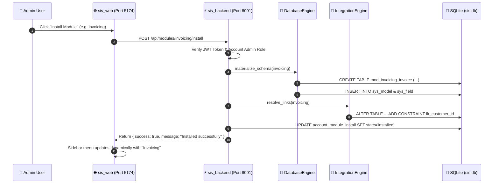
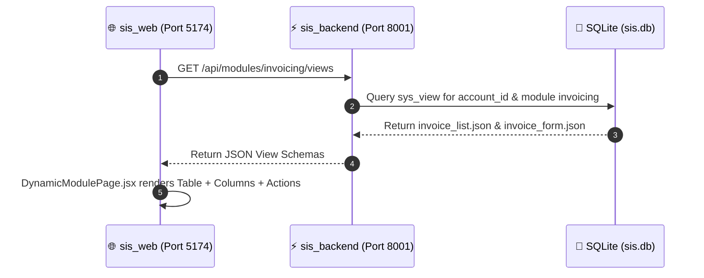
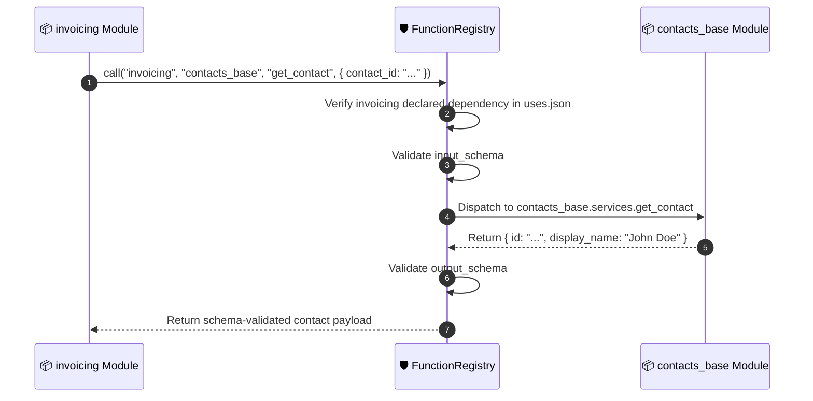

# 11. System Architecture & Data Flow (Mermaid Diagrams)

## 11.1 Module Installation Overview Diagram



---

## 11.2 Module Installation Sequence Diagram



---

## 11.3 Dynamic UI View Composition Sequence Diagram



---

## 11.4 Cross-Module Integration Call Sequence Diagram



---

## Command Line Render Test Code

```powershell
# Command line to build docs site and verify mermaid syntax parsing
mkdocs build
```
