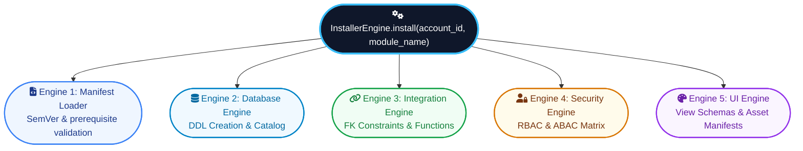

# UNIVA Module System & Installer Engine — Specification Guide

> **Architectural Premise**: The UNIVA Installer Engine is a 100% data-driven orchestration system comprising **Five Engines, One Orchestrator**. Modules never ship executable backend server code except sandboxed hooks. Any cross-module logic reuse or data referencing is mediated via declared, versioned function contracts (`integrations/uses.json` and `functions/exposes.json`). Frontend views dynamically render live from metadata without app rebuilds or full-page swaps; custom UI widgets execute exclusively inside sandboxed `<iframe>` containers via the `postMessage` protocol.

---

## Executive Summary & Quick Navigation

Welcome to the **UNIVA Module System & Installer Engine Single Source of Truth**. This documentation suite defines the architecture, database schema materialization, security matrices, UI live rendering, lifecycle hooks, case studies, and critical security gap analysis for building and maintaining UNIVA modules.

| Chapter | Topic | Highlights |
|---|---|---|
| [1. Architecture Overview](01-architecture-overview.md) | Declarative Vision & Security | 100% Declarative model, Zero-Preinstalled-Tables, SQL Injection defense |
| [2. Module Types](02-module-types.md) | Main vs Extension Modules | Feature comparison matrix, structural rules |
| [3. Directory Layout](03-folder-structure.md) | Module Directory Structure | File inventory, mandatory vs optional checklists |
| [4. 5-Engine Orchestration](04-installer-orchestration.md) | Pipeline Execution | Step-by-step 10-stage install pipeline, rollback & concurrency locks |
| [Engine 1 — Manifest](05-engine-1-manifest.md) | `manifest.json` Spec | JSON Schema, SemVer, prerequisites & integration contracts |
| [Engine 2 — Database](06-engine-2-database.md) | `models/*.json` Schemas | DDL materialization, system columns, soft-delete unique indexes |
| [Engine 3 — Integration](07-engine-3-integration.md) | Data Linking & Function Contracts | Two-phase FK resolution, `sys_field_relation`, `FunctionRegistry` |
| [Engine 4 — Security](08-engine-4-security.md) | `security/access.json` Rules | RBAC CRUD matrix, ABAC `domain_filter` row rules, role seeding |
| [Engine 5 — UI Engine](09-engine-5-ui.md) | `views/*.json` Specifications | Dynamic rendering, column widgets, sandboxed IFrame `postMessage` |
| [Lifecycle & Migrations](10-lifecycle-migrations.md) | Sandboxed Hooks & Migrations | Process isolation ceiling (5s, 128MB), versioned DDL migrations |
| [System Visual Diagrams](11-system-diagrams.md) | Mermaid Sequence & Flow Charts | Module install flow, UI view composition, cross-module calls |
| [Worked Case Studies](12-case-studies.md) | Complete Worked Modules | Code & manifest specs for `farms`, `invoicing`, `schedule`, `pdf_exporter` |
| [REST API Reference](13-api-reference.md) | Endpoint Specifications | Installer APIs & `/api/data/{model_name}` CRUD endpoints |
| [Developer Workflow](14-developer-workflow.md) | Step-by-Step Guide | Authoring walkthrough, local debugging, error remediation guide |
| [Cheatsheet & CLI](15-cheatsheet.md) | Terminal Commands | Docker control, JSON validation scripts, PowerShell/Curl commands |
| [Gap Analysis & Critique](16-gap-analysis.md) | Architectural & Security Audit | 10 priority security gaps, installer bugs, missing engines, permission fix |

---

## Core System Architecture Blueprint



---

## Command Line Quick Reference

```powershell
# Command line to serve MkDocs documentation locally
cd d:\Work\UNIVA\PLUGIN-MODULE-SYSTEM\mkdoc
mkdocs serve

# Command line to build static documentation site
mkdocs build
```
